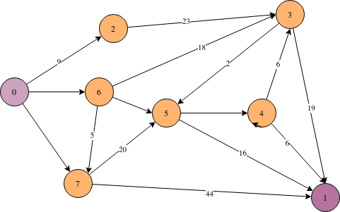
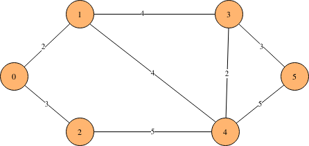
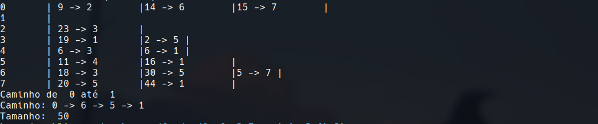

# Prim e Dijkstra

- **Número da Lista**: 19
- **Conteúdo da Disciplina**: Grafos 2

## Alunos

|Matrícula | Aluno |
| -- | -- |
| 211063069 | Breno Queiroz Lima|

## Sobre 
O projeto é um implementação do algoritmo de Dijkstra e Prim.

## Screenshots
Adicione 3 ou mais screenshots do projeto em funcionamento.

<center>

**Input 1**


**Input 2**




</center>

## Instalação 
- **Linguagem**: Go

Para executar o projeto é necessário [baixar](https://go.dev/doc/install) linguagem Go instalada na máquina.

## Uso 

Basta executar

```sh
go run main.go
```

Existe alguns input prontos para realizar os testes, para utilizar:

```sh
go run main.go < in1.txt 
```
## Outros
O vídeo também está disponível pelo Youtube, [link](https://youtu.be/JwVuqTU6DtE).
